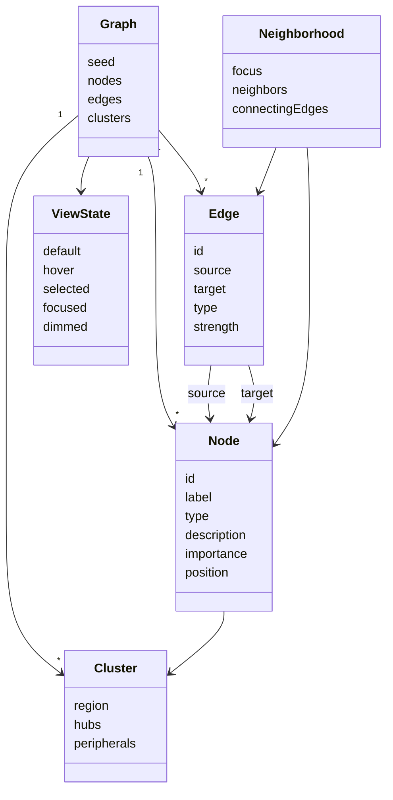

# Domain model

Conceptual meaning only. Persistence, transport, and framework types are not part of this model.

## Ubiquitous language

- A **graph** is one generated universe of nodes and edges.
- A **node** is a knowledge entity with a type and an importance.
- An **edge** is a typed relationship from a source node to a target node.
- A **cluster** is a spatial and topical grouping, not a stored tenant.
- A **neighborhood** is a focus node plus nodes and edges one step away, in either direction.
- **Importance** is a 0–1 value that affects size, default labels, and which nodes read as hubs.
- A **view state** is how the universe is presented: default, hover, selected, focused, dimmed.
- The **explorer** is the person viewing the universe.
- A **dummy graph** is local generated data used only to evaluate visualization.

## Closed vocabularies

**Node types:** person, organization, concept, technology, place, event, document.

**Edge types:** related to, depends on, created by, located in, part of, influences, works at, studied at.

## Actors

- **Explorer:** opens the client, orbits, hovers, selects, and uses chrome controls.
- **Product stakeholder:** judges whether the universe feels like a product. Not a runtime actor.

## Boundary

One local visualization context. No remote knowledge context, identity context, or persistence context in this milestone.

### CON-KUNI-GRAPH · Graph

- **Kind:** concept
- **Knowledge status:** in-review
- **Implementation status:** planned
- **Owner:** product-owner
- **Meaning:** one generated set of nodes, edges, and clusters that the explorer sees as the universe. Randomize replaces the graph with another valid instance.
- **Supports:** `REQ-KUNI-002`, `REQ-KUNI-013`, `WF-KUNI-CONTROL`

### CON-KUNI-NODE · Graph node

- **Kind:** concept
- **Knowledge status:** in-review
- **Implementation status:** planned
- **Owner:** product-owner
- **Meaning:** an identifiable knowledge entity with a label, type, optional description, importance, and a position in the universe.
- **Supports:** `REQ-KUNI-002`, `REQ-KUNI-017`

### CON-KUNI-EDGE · Graph edge

- **Kind:** concept
- **Knowledge status:** in-review
- **Implementation status:** planned
- **Owner:** product-owner
- **Meaning:** a typed link between two node identities, with an optional strength. Source and target name direction; neighborhood ignores direction.
- **Supports:** `REQ-KUNI-004`

### CON-KUNI-TYPE · Category identity

- **Kind:** concept
- **Knowledge status:** in-review
- **Implementation status:** planned
- **Owner:** product-owner
- **Meaning:** a closed set of node or edge categories that share a visual language.
- **Supports:** `REQ-KUNI-003`, `CAP-KUNI-004`

### CON-KUNI-IMPORTANCE · Importance

- **Kind:** concept
- **Knowledge status:** in-review
- **Implementation status:** planned
- **Owner:** product-owner
- **Meaning:** a 0–1 ranking used for size, default labels, and which nodes read as hubs.
- **Supports:** `REQ-KUNI-010`
- **Constrained by:** `INV-KUNI-002`, `ASM-KUNI-002`

### CON-KUNI-CLUSTER · Cluster

- **Kind:** concept
- **Knowledge status:** in-review
- **Implementation status:** planned
- **Owner:** product-owner
- **Meaning:** a topical grouping placed in a region of 3D space with hubs, secondary members, and peripherals.
- **Supports:** `REQ-KUNI-005`

### CON-KUNI-NEIGHBOR · Neighborhood

- **Kind:** concept
- **Knowledge status:** in-review
- **Implementation status:** planned
- **Owner:** product-owner
- **Meaning:** a focus node plus every node and edge one step away, regardless of edge direction.
- **Supports:** `REQ-KUNI-007`, `REQ-KUNI-008`
- **Constrained by:** `INV-KUNI-007`

### CON-KUNI-VIEW · View state

- **Kind:** concept
- **Knowledge status:** in-review
- **Implementation status:** planned
- **Owner:** product-owner
- **Meaning:** the presentation mode of the universe: default, hover, selected, focused, and dimmed. Hover and selected can overlap. Dimmed applies to elements outside the active neighborhood.
- **Supports:** `WF-KUNI-EXPLORE`, `WF-KUNI-INSPECT`
- **Constrained by:** `DEC-KUNI-011`

### CON-KUNI-CAMERA · Camera framing

- **Kind:** concept
- **Knowledge status:** in-review
- **Implementation status:** planned
- **Owner:** product-owner
- **Meaning:** the explorer’s viewpoint, including a home framing that Reset View restores. Focus is a smooth approach toward a selected node.
- **Supports:** `REQ-KUNI-006`, `REQ-KUNI-011`, `DEC-KUNI-016`

### INV-KUNI-001 · Renderer stays generic

- **Kind:** invariant
- **Knowledge status:** in-review
- **Implementation status:** planned
- **Owner:** product-owner
- **Rule:** presentation consumes arbitrary node and edge objects. Dummy names are data, never rendering branches.
- **Supports:** `REQ-KUNI-017`, `DEC-KUNI-008`

### INV-KUNI-002 · Labels follow importance and attention

- **Kind:** invariant
- **Knowledge status:** in-review
- **Implementation status:** planned
- **Owner:** product-owner
- **Rule:** default labels are reserved for important or nearby nodes. Hover or selection always earns a label. Persistent edge labels are not part of this milestone.
- **Supports:** `REQ-KUNI-010`, `DEC-KUNI-012`

### INV-KUNI-003 · Unrelated elements dim rather than vanish

- **Kind:** invariant
- **Knowledge status:** in-review
- **Implementation status:** planned
- **Owner:** product-owner
- **Rule:** hover and selection emphasize a neighborhood by dimming the rest. The rest remains present.
- **Supports:** `REQ-KUNI-007`, `REQ-KUNI-008`, `DEC-KUNI-011`

### INV-KUNI-004 · First slice stays local and dummy

- **Kind:** invariant
- **Knowledge status:** in-review
- **Implementation status:** planned
- **Owner:** product-owner
- **Rule:** this milestone uses only generated local data. No identity, persistence, or remote knowledge source.
- **Supports:** `REQ-KUNI-015`, `NFR-KUNI-006`, `DEC-KUNI-003`

### INV-KUNI-005 · Visual language is centralized

- **Kind:** invariant
- **Knowledge status:** in-review
- **Implementation status:** planned
- **Owner:** product-owner
- **Rule:** type colors, shapes, and default sizes come from one configuration, not from scattered renderer literals.
- **Supports:** `REQ-KUNI-003`, `CRIT-KUNI-018`

### INV-KUNI-006 · Graph size stays in range

- **Kind:** invariant
- **Knowledge status:** in-review
- **Implementation status:** planned
- **Owner:** product-owner
- **Rule:** every generated graph, including after Randomize, has 100–300 nodes and 200–800 edges, at least five node types, and more than one cluster.
- **Supports:** `REQ-KUNI-002`, `REQ-KUNI-013`, `CRIT-KUNI-002`

### INV-KUNI-007 · Neighborhood is first-degree

- **Kind:** invariant
- **Knowledge status:** in-review
- **Implementation status:** planned
- **Owner:** product-owner
- **Rule:** a neighborhood is the focus node plus nodes and edges one hop away in either direction. Second-degree nodes are not emphasized as neighbors.
- **Supports:** `REQ-KUNI-007`, `REQ-KUNI-008`

### INV-KUNI-008 · Search does not change the graph

- **Kind:** invariant
- **Knowledge status:** in-review
- **Implementation status:** planned
- **Owner:** product-owner
- **Rule:** the search field is visible and may accept typing. It does not filter, query, or replace the graph.
- **Supports:** `REQ-KUNI-015`, `DEC-KUNI-007`

### INV-KUNI-009 · Clear and reset restore default view

- **Kind:** invariant
- **Knowledge status:** in-review
- **Implementation status:** planned
- **Owner:** product-owner
- **Rule:** empty-canvas click clears hover, selection, focus, and the details panel. Reset View does the same and restores home camera framing.
- **Supports:** `REQ-KUNI-008`, `REQ-KUNI-011`, `DEC-KUNI-014`

### INV-KUNI-010 · Auto-rotate starts off

- **Kind:** invariant
- **Knowledge status:** in-review
- **Implementation status:** planned
- **Owner:** product-owner
- **Rule:** a new session begins with auto-rotate off. Enabling it yields to explorer camera input.
- **Supports:** `REQ-KUNI-014`, `DEC-KUNI-015`

## Events

| Event | Meaning |
|-------|---------|
| GraphReady | A valid dummy graph is visible |
| PointerEnteredNode | Explorer pointed at a node |
| PointerLeftNode | Explorer left that node |
| NodeSelected | Explorer chose a node |
| SelectionCleared | Selection, panel, and focus ended |
| CameraMoved | Explorer orbited, zoomed, or panned |
| ViewReset | Home framing and default view restored |
| GraphRandomized | A new valid graph replaced the current one |
| LabelsToggled | Default importance labels changed visibility |
| AutoRotateToggled | Idle rotation was enabled or disabled |

## Out of this model

Path finding, influence ranking, timelines, live knowledge, accounts, and persistence are not domain concepts in this milestone.
