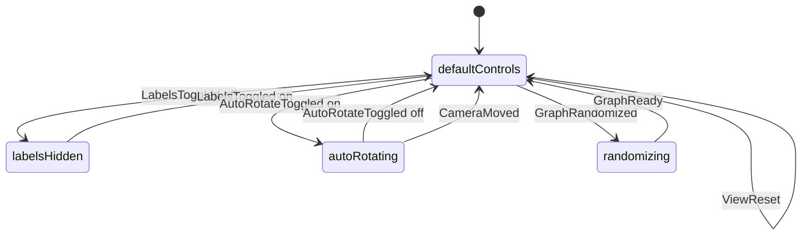

# Explorer workflows

Complex explorer journeys for the first visual milestone. Mechanisms such as specific controls toolkits are not part of these workflows.

### WF-KUNI-EXPLORE · Enter and explore the universe

- **Kind:** workflow
- **Knowledge status:** in-review
- **Implementation status:** planned
- **Owner:** product-owner
- **Purpose:** take the explorer from launch to a readable, orbitable universe.
- **Actors:** Explorer
- **Trigger:** the application opens
- **Preconditions:** a dummy graph can be generated locally
- **States:** launching, default, hovering, camera-moving
- **Happy path:**
  1. The explorer opens the application.
  2. A clustered 3D graph fills the viewport.
  3. Title, legend, and view controls are present but do not dominate.
  4. The explorer orbits, zooms, and pans with damping.
  5. Hovering a node emphasizes its neighborhood and shows its label.
  6. Moving the pointer away restores default emphasis unless a selection is active.
- **Failures:** if the graph cannot be created, the explorer must not be left on a silent broken canvas. First-slice generation is local and expected to succeed.
- **Events:** `GraphReady`, `PointerEnteredNode`, `PointerLeftNode`, `CameraMoved`
- **Invariants:** `INV-KUNI-003`, `INV-KUNI-004`, `INV-KUNI-006`
- **Satisfies:** `UC-KUNI-001`, `CAP-KUNI-001`

```mermaid
stateDiagram-v2
  [*] --> launching
  launching --> default: GraphReady
  default --> hovering: PointerEnteredNode
  hovering --> default: PointerLeftNode
  default --> cameraMoving: CameraMoved
  hovering --> cameraMoving: CameraMoved
  cameraMoving --> default: idle
  cameraMoving --> hovering: PointerEnteredNode
```

### WF-KUNI-INSPECT · Inspect a neighborhood

- **Kind:** workflow
- **Knowledge status:** in-review
- **Implementation status:** planned
- **Owner:** product-owner
- **Purpose:** reveal a node’s meaning and first-degree relationships without leaving the universe.
- **Actors:** Explorer
- **Trigger:** the explorer clicks a node
- **Preconditions:** a graph is visible
- **States:** default, selected, focused, dimmed-background
- **Happy path:**
  1. The explorer clicks a node.
  2. The node becomes selected and is distinct from hover.
  3. First-degree neighbors and connecting edges stay bright.
  4. Unrelated elements dim and remain visible.
  5. A glass panel shows name, type, description, and connection count.
  6. The camera may ease toward the node.
  7. Empty-canvas click or Reset View returns to default.
- **Alternatives:** hover-only inspection emphasizes a neighborhood and shows a label but does not open the panel.
- **Failures:** clicking a non-node does not select. A node without a description still shows name, type, and connection count.
- **Events:** `NodeSelected`, `SelectionCleared`
- **Invariants:** `INV-KUNI-002`, `INV-KUNI-003`, `INV-KUNI-007`, `INV-KUNI-009`
- **Satisfies:** `UC-KUNI-002`, `CAP-KUNI-002`

```mermaid
stateDiagram-v2
  [*] --> default
  default --> selected: NodeSelected
  selected --> focused: camera eases in
  focused --> selected: ease complete
  selected --> default: SelectionCleared
  focused --> default: SelectionCleared
```

### WF-KUNI-CONTROL · Adjust presentation

- **Kind:** workflow
- **Knowledge status:** in-review
- **Implementation status:** planned
- **Owner:** product-owner
- **Purpose:** let the explorer recover framing, change labels, opt into idle motion, or request a new dummy universe.
- **Actors:** Explorer
- **Trigger:** the explorer uses a chrome control
- **Preconditions:** a graph is visible
- **States:** default-controls, labels-hidden, auto-rotating, randomizing
- **Happy path:**
  1. Reset View restores home camera and clears selection, hover, focus, and the panel.
  2. Toggle Labels hides or shows default importance labels. Hover and selection labels remain available.
  3. Toggle Auto Rotate turns slow idle motion on or off. Pointer camera input interrupts it.
  4. Randomize replaces the graph with a new valid instance and returns to default view.
- **Alternatives:** typing in the search placeholder does not start a control workflow and does not change the graph.
- **Failures:** Randomize must not produce a graph outside `INV-KUNI-006`.
- **Events:** `ViewReset`, `LabelsToggled`, `AutoRotateToggled`, `GraphRandomized`
- **Invariants:** `INV-KUNI-002`, `INV-KUNI-006`, `INV-KUNI-008`, `INV-KUNI-009`, `INV-KUNI-010`
- **Satisfies:** `UC-KUNI-003`, `CAP-KUNI-003`


