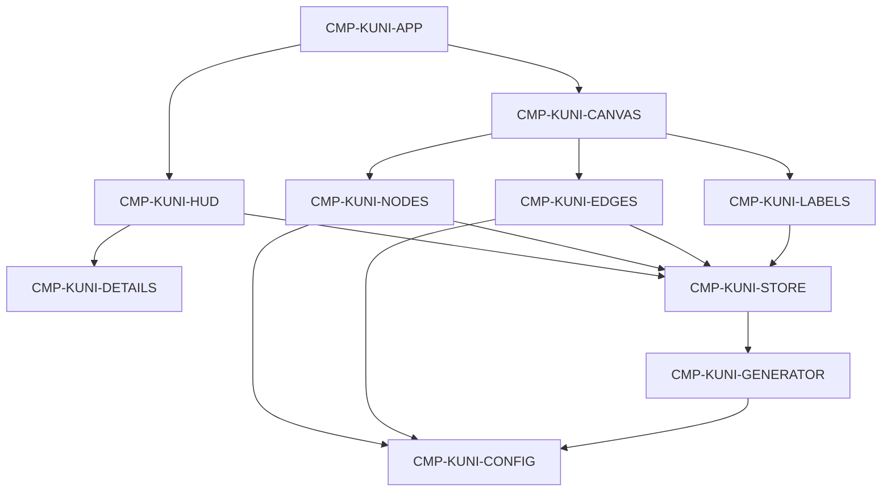

# Architecture

Single-page browser client. No server process. Dummy graph data is generated in memory and rendered by a WebGL canvas. Surrounding chrome is HTML.

This is the first visual slice only. Path finding, timelines, search execution, and persistence are not in this architecture.

## Style

- Client-only application.
- Feature folder for the graph.
- Visual constants live in configuration modules.
- Transient UI state is separate from graph data.

## Dependency direction

Allowed: chrome and renderers read the store, graph value, and config.  
Forbidden: putting the Three.js scene into application state.  
Forbidden: renderer branches on specific dummy labels.

## Runtime

- Vite development server and static production build.
- React owns HTML chrome and the canvas host.
- React Three Fiber owns the scene graph.
- Three.js remains the rendering engine.
- Zustand holds attention flags and the current graph value. See `PAT-KUNI-002`.
- Drei supplies orbit controls and HTML label anchors.
- Tailwind styles chrome. Framer Motion eases the details panel and quiet HUD motion.

## Data ownership

- `CMP-KUNI-GENERATOR` creates a graph instance.
- `CMP-KUNI-STORE` holds the current instance and explorer flags.
- Renderers never own source data.

## Security and privacy

- No authentication, secrets, cookies for identity, or network knowledge calls.
- Dummy public-topic names only. No personal data collection.
- No public API contract.

## Cross-cutting

- Logging is browser console only if needed for defects.
- Testing boundary: typecheck plus observed launch, graph, interaction, and visual review.
- Operations: local `npm run dev`, `npm run build`, `npm run typecheck`, `npm run preview`.

## Foundation-before-optional

1. App foundation and canvas host
2. Types, config, and seeded generator
3. Nodes and edges
4. Camera
5. Hover and selection
6. Labels and details
7. Specified HUD
8. Environment polish
9. Optional: search-placeholder finish, select-to-focus, growth-oriented instancing refinement

## Camera constants

| Setting | Value |
|---------|-------|
| Home position | approximately `(0, 12, 42)` looking at origin |
| Min distance | 8 |
| Max distance | 80 |
| Damping | on, about 0.08 |
| Auto-rotate default | off |
| Auto-rotate speed | Drei/Three `autoRotateSpeed` 0.4 |

## First-pass risks

- Bloom set too high and washing out type color
- Label count creeping up on the default view
- Per-node React meshes defeating `PAT-KUNI-003`
- Chrome covering the graph center on tablet

Residual visual taste remains owner-adjudicated (`CRIT-KUNI-016`).

## Pattern links

`PAT-KUNI-001` through `PAT-KUNI-010` on `CHG-KUNI-001`.
