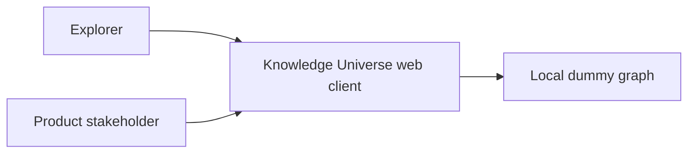

# System map

## Purpose

Let an explorer immediately enter an interactive universe of connected knowledge and judge whether the 3D network feels like the start of a commercial product.

Primary outcome: `OUT-KUNI-001`.

## Actors and externals

- **Explorer:** opens the local application, orbits the graph, hovers and selects nodes, and uses view controls.
- **Product stakeholder:** decides whether visual quality and interaction justify a later real-data layer.
- **No external systems** in the first milestone.

## Applications

One Vite-built React client. React Three Fiber renders the universe. HTML chrome overlays the canvas. Zustand holds attention flags and the current graph value. There is no server.

## Capability map

| Capability | Intent |
|------------|--------|
| `CAP-KUNI-001` | Explore the 3D network |
| `CAP-KUNI-002` | Inspect a selected node |
| `CAP-KUNI-003` | Control camera and presentation |
| `CAP-KUNI-004` | Read the visual language of types |

## Key workflows

- `WF-KUNI-EXPLORE` — enter, orbit, hover, and read spatial structure
- `WF-KUNI-INSPECT` — select a node, see neighborhood emphasis, and read details
- `WF-KUNI-CONTROL` — reset, labels, auto-rotate, and randomize

## Architecture outline

Client-only. Generator creates a seeded clustered graph. Shared or instanced geometries draw nodes. Buffer-backed lines draw edges. HTML owns labels and HUD. Patterns `PAT-KUNI-001`–`010`.

## Quality and operations posture

- Success is visual quality, interaction feel, and a maintainable local prototype.
- Verification is launch, typecheck, interaction observation, and owner visual review.
- Operations are local development only.

## Next reading

- [Business brief](knowledge/01-business/brd.md)
- [Requirements](knowledge/02-requirements/requirements.md)
- [Non-functional requirements](knowledge/02-requirements/nfr.md)
- [Domain model](knowledge/03-domain/domain.md)
- [Explorer workflows](knowledge/03-domain/workflows/explorer.md)
- [Architecture](knowledge/04-design/architecture/overview.md)
- [Experience](knowledge/04-design/experience/experience.md)
- [Quality Design Contract](changes/active/CHG-KUNI-001/quality-design-contract.md)
- [Execution plan](changes/active/CHG-KUNI-001/execution-plan.md)
- [Implementation readiness review](changes/active/CHG-KUNI-001/implementation-readiness-review.md)
