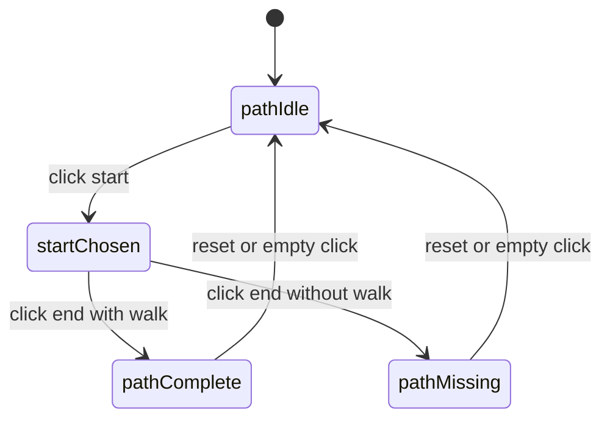
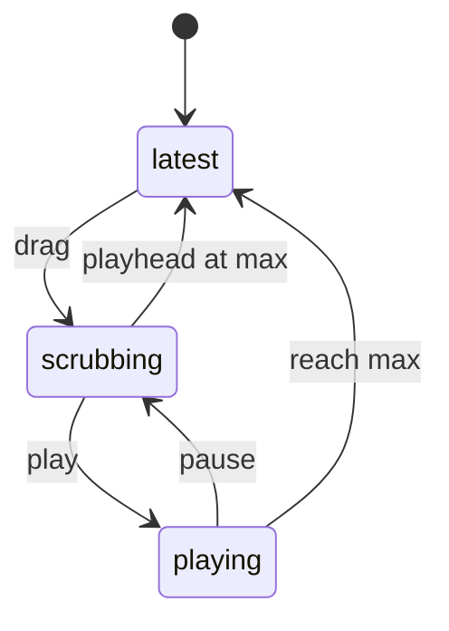

# Explorer workflows

### WF-KUNI-EXPLORE · Enter and explore the universe

- **Kind:** workflow
- **Knowledge status:** approved
- **Implementation status:** verified
- **Owner:** product-owner
- **Purpose:** take the explorer from launch to a readable, orbitable universe.
- **Actors:** Explorer
- **Trigger:** the application opens
- **Preconditions:** a dummy graph can be generated locally
- **States:** launching, default, hovering, camera-moving
- **Happy path:**
  1. The explorer opens the application.
  2. A clustered 3D graph fills the viewport.
  3. The explorer orbits, zooms, and pans.
  4. Hovering a node emphasizes its neighborhood.
  5. Moving the pointer away restores default emphasis.
- **Failures:** if the graph cannot be created, the explorer must not be left on a broken empty canvas without explanation. First-slice generation is local and expected to succeed.
- **Invariants:** `INV-KUNI-003`, `INV-KUNI-004`
- **Satisfies:** `UC-KUNI-001`
- **Verified by:** `TEST-KUNI-001`

```mermaid
stateDiagram-v2
  [*] --> launching
  launching --> default: graph ready
  default --> hovering: pointer on node
  hovering --> default: pointer leaves
  default --> cameraMoving: orbit zoom pan
  hovering --> cameraMoving: orbit zoom pan
  cameraMoving --> default: idle
  cameraMoving --> hovering: pointer on node
```

### WF-KUNI-INSPECT · Inspect a neighborhood

- **Kind:** workflow
- **Knowledge status:** approved
- **Implementation status:** verified
- **Owner:** product-owner
- **Purpose:** reveal a node's meaning and first-degree relationships without leaving the universe.
- **Actors:** Explorer
- **Trigger:** the explorer clicks a node
- **Preconditions:** a graph is visible
- **States:** default, selected, focused, dimmed-background
- **Happy path:**
  1. The explorer clicks a node.
  2. The node becomes selected.
  3. Neighbors and connecting edges stay bright.
  4. Unrelated elements dim.
  5. A glass panel shows name, type, description, and connection count.
  6. The camera may ease toward the node.
  7. Empty-space click or Reset View returns to default.
- **Alternatives:** hover-only inspection does not open the panel.
- **Invariants:** `INV-KUNI-002`, `INV-KUNI-003`
- **Satisfies:** `UC-KUNI-002`
- **Verified by:** `TEST-KUNI-003`

```mermaid
stateDiagram-v2
  [*] --> default
  default --> selected: click node
  selected --> focused: camera eases in
  focused --> selected: ease complete
  selected --> default: click empty or reset
  focused --> default: click empty or reset
```

### WF-KUNI-PATH · Trace a shortest path

- **Kind:** workflow
- **Knowledge status:** approved
- **Implementation status:** verified
- **Owner:** product-owner
- **Purpose:** answer how two entities meet.
- **Actors:** Explorer
- **Trigger:** explorer enters Path mode
- **States:** path-idle, start-chosen, path-complete, path-missing
- **Happy path:**
  1. Explorer chooses Path mode.
  2. First node becomes the start.
  3. Second node becomes the end.
  4. The shortest path lights and a semantic chain appears.
- **Failures:** if no walk exists, chrome says so and the two endpoints stay selected.
- **Invariants:** `INV-KUNI-006`
- **Satisfies:** `UC-KUNI-004`
- **Verified by:** `TEST-KUNI-006`



### WF-KUNI-TIMELINE · Travel through years

- **Kind:** workflow
- **Knowledge status:** approved
- **Implementation status:** verified
- **Owner:** product-owner
- **Purpose:** read the universe as something that appears over time.
- **Actors:** Explorer
- **Trigger:** explorer moves the playhead or presses Play
- **States:** latest, scrubbing, playing
- **Happy path:**
  1. Default year is the latest year.
  2. Explorer drags earlier.
  3. Later nodes dim.
  4. Play advances toward the latest year.
- **Invariants:** `INV-KUNI-007`
- **Satisfies:** `UC-KUNI-005`
- **Verified by:** `TEST-KUNI-008`


