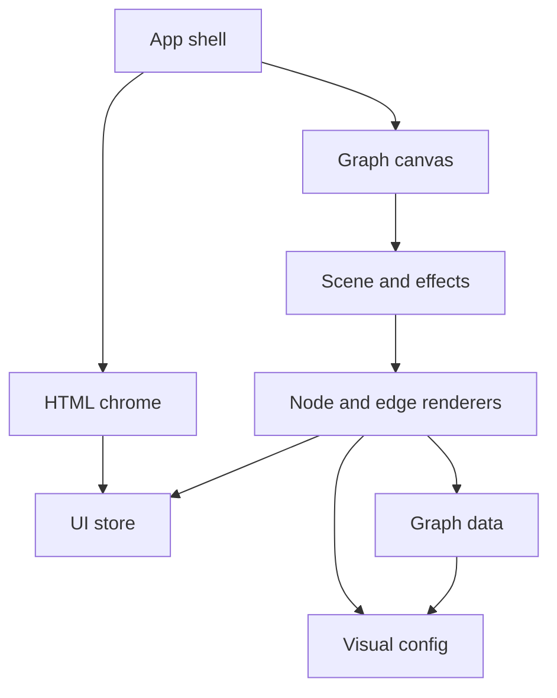

# Architecture

Single-page browser client. No server process. Dummy graph data is generated in memory and rendered by a WebGL canvas. Surrounding chrome is HTML.

## Style

- Client-only application.
- Feature folder for the graph.
- Visual constants live in configuration modules.
- Transient UI state is separate from graph data.

## Dependency direction

Allowed: chrome and renderers read stores and data. Forbidden: putting the Three.js scene into application state. Forbidden: renderer branches on specific dummy labels.

## Runtime

- Vite development server and static production build.
- React owns HTML chrome and the canvas host.
- React Three Fiber owns the scene graph.
- Three.js remains the rendering engine.
- Zustand holds selected, hovered, label, auto-rotate, and focus flags.
- Graph data is replaceable in a dedicated store or module, not mixed with camera objects.

## Cross-cutting

- No authentication or secrets.
- No network I/O in the first slice.
- Logging is browser console only if needed for defects.
- Testing boundary: typecheck plus observed launch and interaction evidence.

### ADR-KUNI-001 · Adopt the confirmed client stack

- **Kind:** decision
- **Knowledge status:** approved
- **Implementation status:** verified
- **Owner:** knowledge-universe-team
- **Decision:** React, TypeScript, Vite, Three.js, React Three Fiber, Drei, Zustand, Tailwind CSS, and Framer Motion.
- **Because:** stakeholder confirmation. Angular and Vue are out.
- **Consequence:** scene composition is componentized; Three.js primitives stay available for instancing and buffers.
- **Supports:** `NFR-KUNI-004`

### ADR-KUNI-002 · Dummy-data first slice

- **Kind:** decision
- **Knowledge status:** approved
- **Implementation status:** verified
- **Owner:** knowledge-universe-team
- **Decision:** ship only a generated local graph. Defer real entities, search execution, AI, and persistence.
- **Because:** the milestone is visual quality.
- **Consequence:** a generator module is the data source; search chrome is inert.
- **Constrained by:** `INV-KUNI-004`

### ADR-KUNI-003 · Shared geometry over per-node scenes

- **Kind:** decision
- **Knowledge status:** approved
- **Implementation status:** verified
- **Owner:** knowledge-universe-team
- **Decision:** repeated node forms use instancing or shared geometries. Edges use a small number of buffer-backed line objects. Hover and selection update attributes or instance state rather than remounting the scene.
- **Because:** `NFR-KUNI-002` and `NFR-KUNI-003`.
- **Consequence:** later growth to thousands of nodes has a path; first slice still targets 100–300 nodes.

### ADR-KUNI-004 · HTML overlays for chrome and labels

- **Kind:** decision
- **Knowledge status:** approved
- **Implementation status:** verified
- **Owner:** knowledge-universe-team
- **Decision:** product chrome, details, legend, and node labels use HTML and CSS, including Drei HTML anchors where a label must track a node.
- **Because:** readable type and glass styling are easier and sharper in HTML than in glyph textures.
- **Supports:** `REQ-KUNI-009`, `REQ-KUNI-010`

### ADR-KUNI-005 · Run algorithms in the client

- **Kind:** decision
- **Knowledge status:** approved
- **Implementation status:** verified
- **Owner:** knowledge-universe-team
- **Decision:** shortest path and influence compute in a dedicated analysis module on the current in-memory graph.
- **Because:** `INV-KUNI-006` and the still-local milestone.
- **Consequence:** no Neo4j or API. Later real graphs can replace the module's input, not the explorer journey.

### ADR-KUNI-006 · Year is the first temporal grain

- **Kind:** decision
- **Knowledge status:** approved
- **Implementation status:** verified
- **Owner:** knowledge-universe-team
- **Decision:** each node has one appearance year. The playhead is a single year. See `FND-KUNI-005`.
- **Because:** a month-level timeline would add chrome without new approved meaning.
- **Supports:** `REQ-KUNI-023`, `REQ-KUNI-024`
