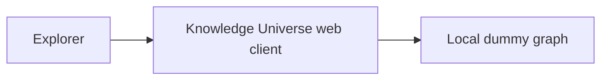

# System map

## Purpose

Let an explorer immediately enter an interactive universe of connected knowledge and judge whether the 3D network feels like the start of a commercial product.

Primary outcome: `OUT-KUNI-001`.

## Actors and externals

- **Explorer:** a person who opens the local application, orbits the graph, hovers and selects nodes, and uses view controls.
- **No external systems** in the first milestone. There is no backend, identity provider, search index, or graph database.

## Applications

- One Vite-built React client that owns the full-screen WebGL canvas and a thin glass HUD.

## Capability map

| Capability | Intent |
|------------|--------|
| `CAP-KUNI-001` | Explore the 3D network |
| `CAP-KUNI-002` | Inspect a selected node |
| `CAP-KUNI-003` | Control camera and presentation |
| `CAP-KUNI-004` | Read the visual language of types |
| `CAP-KUNI-005` | Trace structure with algorithms |
| `CAP-KUNI-006` | Read semantic links |
| `CAP-KUNI-007` | Travel the timeline |

## Key workflows

- `WF-KUNI-EXPLORE` — enter, orbit, hover, and read spatial structure.
- `WF-KUNI-INSPECT` — select a node, see neighborhood emphasis, and read details.
- `WF-KUNI-PATH` — choose two nodes and read the shortest semantic walk.
- `WF-KUNI-TIMELINE` — move a year playhead and watch later knowledge dim.

## Architecture outline

A single-page client. Graph data is generated locally. Rendering uses React Three Fiber over Three.js. Transient UI state lives in Zustand. Visual language is centralized in configuration. No server, no persistence.

## Quality and operations posture

- Success is visual quality, interaction feel, and maintainable rendering structure.
- Verification is launch, typecheck, interaction observation, and desktop layout checks.
- Operations for this slice are local development only.

## Generated status

- [Current generated status](generated/status.md)

## Next reading

- [Business brief](knowledge/01-business/brd.md)
- [Requirements](knowledge/02-requirements/requirements.md)
- [Non-functional requirements](knowledge/02-requirements/nfr.md)
- [Domain](knowledge/03-domain/domain.md)
- [Architecture](knowledge/04-design/architecture/overview.md)
