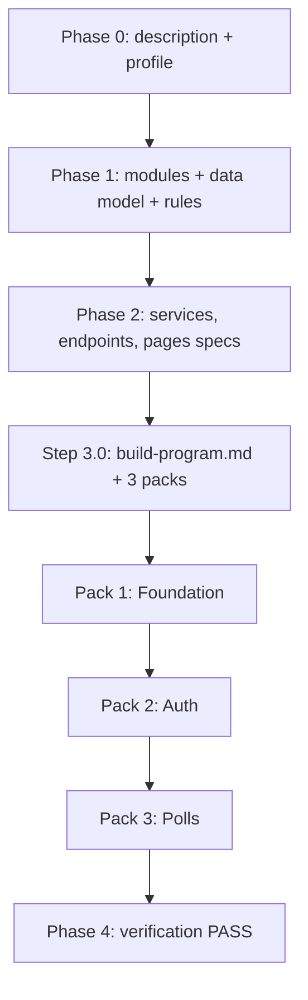

# PollPulse — RoyaScaff Engine Example (v1.2)

A complete reference implementation showing how the RoyaScaff AI-Control Engine works from product description to verified, running code.

**PollPulse** is a lightweight team polling app: register, create polls with 2–5 options, vote once, view live results.

## What this folder demonstrates

| Engine phase | Output in this example |
|--------------|------------------------|
| Bootstrap | `project/` skeleton |
| Phase 0 — Understand | `project/description.md`, `project/profile.md` |
| Phase 1 — Plan | `project/plan/modules.md`, `data-model.md`, `project/rules.md` |
| Phase 2 — Actions | `project/actions/api/` + `project/actions/web/` (all `planned` → `done`) |
| Phase 3 — Build | 3 REQ-INIT work packs in `project/changes/` |
| Phase 4 — Verify | `project/status.md`, `project/verify/verification-report.md` |

## Folder layout

```text
example-v1.2/
  README.md           ← you are here
  project/            ← blueprint (SSOT — copy this to rebuild)
    profile.md
    description.md
    plan/
    actions/
    changes/          ← build-program, change-log, merged packs
    status.md
    verify/
  apps/
    api/              ← Express + SQLite backend
    web/              ← React + Vite + Tailwind frontend
```

## Quick start

### 1. API

```bash
cd apps/api
cp .env.example .env
npm install
npm run dev
```

API runs at `http://localhost:3001`. Health check: `GET /health`

### 2. Web

```bash
cd apps/web
cp .env.example .env
npm install
npm run dev
```

Web runs at `http://localhost:5173`

### 3. Try it

1. Open `http://localhost:5173`
2. Register a new account
3. Create a poll with 2+ options
4. Open the poll in another browser/incognito, register a second user, vote
5. See results update; close the poll as creator

## How the engine flow maps here



### Work packs (REQ-INIT)

| Pack | Folder | What it built |
|------|--------|---------------|
| 1/3 | `change-20260805-120001-init-foundation` | API shell, DB, health, web routing |
| 2/3 | `change-20260805-120002-init-auth` | Register, login, JWT |
| 3/3 | `change-20260805-120003-init-polls` | Full polls feature |

Each pack folder contains the engine artifacts: `change-request.md`, `blueprint/`, `impact.md`, `status.md`, `verify-code.md`, `merge-report.md`.

## Resume pattern (for learning)

To see how a future session would continue:

1. Read `project/changes/change-log.md`
2. Read `project/changes/build-program.md`
3. Read `project/status.md`
4. Open the next pack folder (if any remain)

In this example all packs are **merged** — next work would use `/change-mode`.

## Tech choices (kept simple on purpose)

- **SQLite** — built-in `node:sqlite` (Node.js 22.5+); file at `apps/api/data/pollpulse.db`, no native build step
- **Express** — minimal backend, clear controller → service → repository layering
- **React + Vite + Tailwind** — modern frontend without heavy framework overhead

## Related engine docs

- [Initial build flow](../engine/flows/initial-build.md)
- [Project layout](../engine/project-layout.md)
- [Quickstart guide](../docs/guides/02-quickstart.md)
