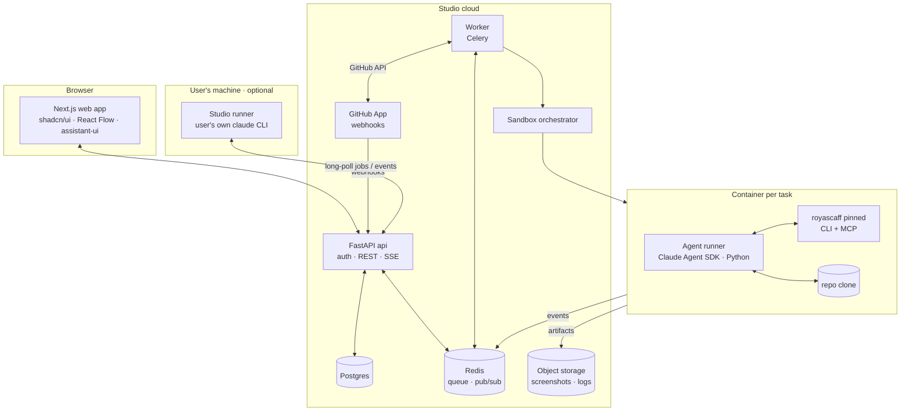

# 04 — RoyaScaff 2.0: Studio (the SaaS)

> **Goal:** a beautiful web product where a business owner, a developer team and their
> clients build and change real software with AI, on the RoyaScaff method: every change
> starts from a stated need, is designed, tested, reviewed by a person and traceable to
> the code.
> **Repo:** `royascaff-studio` (new) · **Releases:** `studio 0.x` (private alpha) → `1.0` (public).
> **2.0** = Studio 1.0 + engine 1.7.
> **Decisions:** README §2 (D1–D10).

---

## 1. The product

### 1.1 The problem: why vibe coding breaks

| Vibe-coding tools today | What goes wrong | Studio's answer |
|---|---|---|
| A prompt becomes code directly | Nobody knows which need a piece of code serves | Every change links need → requirement → design → task → code → evidence |
| The AI says "done" | Untested, half-working features | Tests first (red), machine checks, a separate judge, a person's look |
| One long chat per project | Context is lost; the AI rewrites working parts | The engine gives each task a small context pack; knowledge lives in the repo |
| Great for demos, bad for the second month | Changes break old features | Impact tables, requirement deltas, stale evidence, baselines, rollback |
| One person, one browser tab | Teams and clients can't take part | Roles, approvals, a client portal, a team lens |
| Code locked in the tool | Lock-in | The customer's own GitHub repo; the engine's files are plain Markdown in it |

**Positioning line:** *"Build software with AI the way a good team would: planned, tested, reviewed, and yours."*

### 1.2 Who uses it

| Persona | Goal in Studio | Main screens |
|---|---|---|
| **Business owner** | Describe what they need, approve plans, see progress, accept results | Chat, Product lens, Approvals, Client portal |
| **Developer** | Build and fix with AI help, review diffs, run checks | Space (all lenses), Change view, Chat, Runs |
| **Team lead** | Plan features, assign work, approve designs, keep quality | Team lens, Board, Approvals, Insights |
| **Client** (of an agency) | See what's delivered, try it, give feedback, accept | Client portal only |
| **Workspace admin** | Members, GitHub, AI keys, runners, billing | Settings |

### 1.3 The core loop in Studio

1. **Connect or create** a GitHub repo → Studio adds the engine (pinned version) through a first pull request.
2. **Describe** the product or the change in chat → discovery questions appear as cards → the owner answers.
3. **Approve** the project, then the roadmap (buttons, signed approvals).
4. **Build**: Studio runs agents in containers (or the user's runner) change by change. Each change works on its own branch and opens a pull request with its evidence.
5. **Review**: diff, screenshots, test results, the judge's verdict → the person's check → merge.
6. **See it all** in the Space: what exists, what's changing, who's on it, what the client can see.

---

## 2. Principles

1. **Git is the truth** (D2). If Studio's database were lost, rebuilding the index from the repos restores everything except Studio-only data (chats, comments, runs, billing).
2. **Contract only** (D6). Studio never imports engine code; it runs the pinned engine in the sandbox and reads JSON envelopes. `packages/engine-contract` holds generated types.
3. **People approve, agents propose.** No agent can approve, merge, or change billing or members.
4. **Tenant isolation everywhere**: data, sandboxes, storage paths, queues, logs.
5. **Beautiful and calm**: a clear design system, fast (< 200 ms interactions), keyboard-first, excellent empty states.
6. **Boring infrastructure**: well-known libraries Claude Code knows well; no clever frameworks.
7. **Everything observable**: every run has a timeline, a cost and a result.

---

## 3. System architecture



| Part | Tech | Responsibility |
|---|---|---|
| `apps/web` | Next.js (App Router), TypeScript, Tailwind, shadcn/ui, React Flow + ELK.js, assistant-ui, TanStack Query, Zustand (UI state only) | All screens; no business logic beyond display |
| `apps/api` | Python 3.12, FastAPI, Pydantic v2, SQLAlchemy 2 + Alembic, Authlib | Auth, tenancy, REST + SSE, permissions, signed approvals, GitHub webhooks |
| `apps/worker` | Celery + Redis | Jobs: index a repo, run an agent task, open a PR, verify, bill usage |
| `sandbox/` | Docker images (Node LTS + Python + Playwright + pinned engine + Claude Agent SDK) | Runs one task in isolation, streams events |
| `runner/` | Python CLI (`royascaff-runner`), pip-installable | The user's machine takes jobs and runs the user's `claude` CLI (file 03 §7) |
| `packages/engine-contract` | Types generated from the engine's JSON Schemas (TS + Pydantic) | The only knowledge Studio has of the engine |
| `packages/ui` | Design tokens and shared components | One look everywhere |
| `infra/` | Terraform, Helm (or ECS task definitions), GitHub Actions | Environments: dev, staging, prod |

**API style:** REST with OpenAPI; the web client is generated from it (`openapi-typescript` + a small fetch wrapper). Live updates use **SSE** (runs, chat streams, index progress). WebSockets are only added if SSE proves insufficient.

---

## 4. AI: two modes (D1)

### 4.1 Server mode (API key)

- The worker starts a **sandbox container** for the task. Inside it, `sandbox/agent/run_task.py` uses the **Claude Agent SDK (Python)**:
  - working directory = the repo clone on the change's branch;
  - the engine as the main tool: **the CLI in JSON mode** (contract v1: `next --json`, `context`, `task start/done`, `verify`) for projects on engine 1.5–1.6, and **the MCP server** (`royascaff mcp`, stdio) once the project pins 1.7; plus the SDK's built-in file and shell tools, limited to the workspace;
  - the prompt = the engine's next action + the context pack for the claimed task;
  - `max_turns` and a **USD budget** per task (the SDK's budget option), plus Studio's own token cap enforced from the usage data in a hook;
  - hooks stream every tool use and engine event to Redis → the API → the browser.
- **Keys never enter the sandbox.** The workspace's own Anthropic key (BYOK, encrypted) or Studio's platform key (usage billed, §11) stays in the worker. The sandbox gets `ANTHROPIC_BASE_URL` pointing at Studio's **AI egress proxy** and a per-run proxy token that expires with the run. The proxy checks the token, adds the real key, enforces the budget, and records usage. A prompt-injected agent can read only a token that is useless outside that run.
- **Models:** per workspace default, with an override per task type (e.g. a stronger model for the judge).

### 4.2 Runner mode (the user's own Claude)

- The user installs `pipx install royascaff-runner` and runs `royascaff-runner login` (Studio device-code sign-in) and then `royascaff-runner start`.
- The runner implements the engine's runner protocol (file 03 §7): it long-polls Studio for jobs of its workspace, clones the repo with the **user's own git credentials**, and runs the user's installed `claude` CLI headless (`claude -p … --output-format stream-json --verbose`) with the engine skill and MCP configured. It streams events back and pushes the branch.
- Studio never sees or stores the user's Claude credentials. The runner shows the user every job before the first run, with an "auto-accept for this project" option.
- Jobs can target "any runner of mine", "this runner", or "cloud".
- **R1:** confirm this model with Anthropic before public launch (README §2).

### 4.3 The chat

- **assistant-ui** in a dock on every project screen, plus a full-page chat.
- The chat is an **orchestrator**, not a code editor: it runs a lightweight agent (API key, server-side, no sandbox) with Studio tools:
  - `ask_engine` (read-only contract calls through an index sandbox or the index DB),
  - `start_task_run`, `open_change`, `plan_feature`, `request_approval`, `explain_node`.
- Selecting a node in the Space adds it to the chat's context ("Explain this component", "Fix this requirement").
- Engine questions (QST-) and approval requests appear as **interactive cards** inside the chat (tool UIs in assistant-ui): answer, approve, or open the design.
- Slash commands: `/continue`, `/plan`, `/fix`, `/status`, `/approve` (opens the approval sheet; never approves by itself).

---

## 5. Sandboxes and git (D5, D9)

**Life of one task run:**
1. The worker claims the task in Studio's claim table (and with the engine's `claim_task` once the project pins 1.7).
2. The orchestrator starts a container from `sandbox:<engine-version>` with CPU/RAM limits, a disk quota, a time limit, and **egress allowed only to** the package registries and Studio's AI egress proxy (§4.1). Git traffic goes through the worker.
3. The **worker** (not the sandbox) clones with a **GitHub App installation token** scoped to that repo, checks out `royascaff/CHG-…` (created on the change's first run), and mounts the clone into the container. The sandbox gets no GitHub token.
4. It runs the agent (§4.1). Every engine event and tool use is streamed.
5. The agent commits inside the sandbox; the **worker** pushes the branch, and only to `royascaff/CHG-…` (it refuses any other ref). It uploads screenshots and logs to object storage under `org/<id>/project/<id>/run/<id>/`.
6. When the change's tasks are done and checks have run, the worker opens or updates the **pull request**: title = change title; body = requirements, the Impact summary, evidence (tests, screenshots, metrics), the judge verdict when the pinned engine has one (1.5+), and a link to Studio.
7. The container is destroyed. Nothing persists except the branch, the artifacts and the events.

**GitHub App:**
- Permissions: contents (rw), pull requests (rw), metadata (r), checks (rw), workflows (rw, for the CI template), administration (rw, to create repos and set rulesets in organizations). Webhook events: push, pull_request (installation events are always delivered).
- **Branch protection is required.** On connect, Studio checks for (or, with permission, creates) a ruleset on the default branch: no direct pushes, pull request required. Without it the project can't start runs. This is what makes D9 enforceable, not only a promise.
- **Create a repo** for new projects: in an organization through the App (administration permission); in a personal account through the **user's own GitHub authorization** (a user-to-server token, since installation tokens can't create personal repos). The repo starts **empty** (or with a README only); the engine setup arrives as **pull request #1**, so nothing is pushed to the default branch.
- **Connect an existing repo** → the first PR adds `project/` via `init` + `adopt` (file 01 §6).
- A merged PR triggers **re-indexing** of the default branch.
- `royascaff ci` runs as a GitHub check on each PR (file 01 V11).

**Git control in the UI:** branches per change, PR status, merge (by a person with the right role; uses GitHub's merge API), conflicts shown with a "rebase with AI" action (a new task run), and a commit timeline per change.

---

## 6. Data model (Postgres)

All tenant tables carry `org_id`. **Row-level security**, done correctly:
- the API and the worker connect as an application role that is **not** the table owner, not a superuser and has no `BYPASSRLS`; migrations run as a separate owner role;
- `ALTER TABLE … ENABLE ROW LEVEL SECURITY` and `FORCE ROW LEVEL SECURITY` on every tenant table;
- policy: `org_id = current_setting('app.org_id', true)::uuid`;
- the org is set per transaction with `SET LOCAL` (`set_config('app.org_id', …, true)`), never a session-level `SET`, so pooled connections can't leak it;
- the service layer checks permissions as well (defense in depth).

| Area | Tables |
|---|---|
| Identity | `users`, `orgs`, `memberships (role)`, `invitations`, `sessions`, `api_tokens`, `audit_log` |
| Projects | `projects (engine_version, default_branch, visibility)`, `repos (github_repo_id, installation_id)`, `runners`, `ai_credentials (encrypted)` |
| Work | `runs (task, change, mode, status, cost, tokens, started/ended)`, `run_events (seq, kind, payload)`, `claims`, `jobs` |
| Collaboration | `threads`, `messages`, `comments (anchor: record_id or code_node)`, `notifications`, `approval_requests`, `approvals (signed token jti, hash)` |
| **Index (projection)** | `idx_records (id, kind, title, fields jsonb, status, version)`, `idx_links (from, rel, to)`, `idx_events`, `idx_evidence`, `idx_code_nodes (path, kind, component)`, `idx_code_edges (from, to, kind)`, `idx_snapshots (commit_sha, engine_version)` |
| Client | `client_shares (project, scope, expires)`, `client_feedback` |
| Billing | `subscriptions`, `plans`, `usage_ledger (org, run, tokens, cost, source: platform|byok|runner)`, `invoices` (mirror of Stripe) |

**The index is a projection.** The indexer job runs in an index sandbox at a commit:
`royascaff export --json` + `royascaff status --json`, plus `scan --json` and `inventory --json` **when the pinned engine's `contract --json` lists them** (1.5.0+). Lenses that need a missing command show "needs engine 1.5" instead of failing.
It validates the output against the contract version and upserts the rows for `(project, commit_sha)`. Rebuilding = deleting the rows and re-running. Indexing is keyed by commit, so it can be cached and repeated safely.

---

## 7. Roles and permissions

| Action | Owner | Admin | Lead | Developer | Reviewer | Client |
|---|---|---|---|---|---|---|
| Billing, delete workspace | ✅ | | | | | |
| Members, GitHub, AI keys, runners | ✅ | ✅ | | | | |
| Create or connect projects | ✅ | ✅ | ✅ | | | |
| Approve project / roadmap | ✅ | ✅ | ✅ | | | |
| Approve a change design | ✅ | ✅ | ✅ | ✅ (low/medium) | ✅ | |
| Start AI runs, chat | ✅ | ✅ | ✅ | ✅ | | |
| Person's check (look) | ✅ | ✅ | ✅ | ✅ | ✅ | ✅ (if shared) |
| Merge a PR | ✅ | ✅ | ✅ | project setting | | |
| Measure outcomes | ✅ | ✅ | ✅ | | | ✅ (if shared) |
| See code | ✅ | ✅ | ✅ | ✅ | ✅ | ❌ |

Every approval or check becomes a **signed approval token** (file 03 §6), issued only after a UI action by a signed-in person (with re-authentication for high and critical risk), and passed to the engine in the sandbox. The engine records `by: <user> via studio`.

**Auth:** GitHub OAuth (primary, since users need GitHub anyway) and email magic links. Session cookies (HttpOnly, SameSite=Lax) plus CSRF tokens. TOTP two-factor for owners and admins. SSO/SAML later through a provider (WorkOS or similar); the auth module is behind an interface so it can be swapped.

---

## 8. Screens

**Design system:** shadcn/ui on Tailwind with tokens in `packages/ui/tokens.css`. Light and dark themes. Inter for text, JetBrains Mono for code. Lucide icons. Motion (Framer Motion) only for meaning: status changes, panel transitions. WCAG AA contrast. Every list has empty, loading and error states. Keyboard: `⌘K` command palette, `g s` Space, `g b` Board, `?` shortcuts.

| Screen | Purpose | Key elements |
|---|---|---|
| **Home** | All projects of the workspace | Cards with health, open changes, waiting approvals, last activity |
| **Project Space** | The heart of Studio | Full canvas (React Flow + ELK auto-layout), lens switcher, minimap, search, side panel, chat dock |
| **Board** | Changes by status | Columns draft → closed; card = change, risk, owner, runner, evidence dots |
| **Change** | One change end to end | Stage timeline (Understand → Design → Plan → Build → Verify → Record), Impact table, design, tasks, live run log, diff, screenshots, judge verdict, PR, "Approve" and "Look" buttons |
| **Approvals inbox** | Everything waiting for a person | Grouped by project; each opens a review sheet showing exactly what the fingerprint covers |
| **Runs** | Agent activity | Live timeline, tool calls, cost, tokens, stop button, retry |
| **Discovery** | The request, demands, questions, assumptions, visual bar | Answer questions inline; coverage meter |
| **Roadmap** | Outcomes, features, slices by horizon | Drag between Now/Next/Later (creates a change for approval); approve roadmap |
| **Insights** | Quality over time | Pass rates, rework, stale evidence, time per stage, cost per change, engine version comparisons |
| **Client portal** | For clients | Outcomes, delivered features, releases ("what's new" from engine `diff`, once projects pin 1.6), screenshots, a "try it" link to the preview, feedback, acceptance |
| **Settings** | Workspace | Members and roles, GitHub, AI keys, runners, engine versions, billing, audit log |

### 8.1 The four lenses of the Space (D7)

| Lens | Nodes | Edges | Colors / badges |
|---|---|---|---|
| **Product** | OUT → CAP → SLC → CHG → TASK | delivers, realizes, part-of | Status (planned, in progress, done, stale, blocked); approvals waiting |
| **Architecture** | Components (CMP), grouped by layer; rules | depends-on (from code), allowed / forbidden (from RULE) | Rule violations in red; ownership %; inferred ⏳ |
| **Code graph** | Modules → files (collapsible) | imports | Owner component color; files changed by open changes glow; hot files by churn |
| **Team & client** | People, changes, tasks | owns, claims, waits-for-approval | Avatars on nodes; what each client can see (a toggle shows the client's view) |

Shared behavior: click → side panel (fields, links, history, comments, "Ask AI"); double-click → focus mode; `⌘F` search across all lenses; a **"changes since"** timeline slider (uses engine baselines/diff, 1.6); a split view that shows two lenses linked (selecting a component highlights its files and its requirements).

Performance: server-side layout caching per commit; the canvas virtualizes above 2,000 nodes; the code lens starts collapsed to modules.

---

## 9. API surface (first version)

```
GET  /auth/github/callback · POST /auth/magic-link · POST /auth/logout
GET  /me · GET/POST /orgs · GET/POST /orgs/{org}/members · POST /invitations/{id}/accept
GET/POST /orgs/{org}/projects · GET /projects/{p} · POST /projects/{p}/connect-repo · POST /projects/{p}/create-repo
GET  /projects/{p}/space?lens=product|architecture|code|team&commit=…
GET  /projects/{p}/records/{id} · GET /projects/{p}/board · GET /projects/{p}/inventory
POST /projects/{p}/runs   (task|change|continue)      · GET /runs/{r} · GET /runs/{r}/events (SSE) · POST /runs/{r}/stop
GET/POST /projects/{p}/threads · POST /threads/{t}/messages (SSE stream)
GET  /approval-requests · POST /approval-requests/{id}/approve · POST /approval-requests/{id}/reject
POST /projects/{p}/checks  (person's look with bar lines)
GET/POST /projects/{p}/comments
GET/POST /orgs/{org}/runners · GET /runner/jobs (long-poll) · POST /runner/jobs/{j}/events · POST /runner/jobs/{j}/result
POST /webhooks/github · POST /webhooks/stripe
GET  /projects/{p}/client-view (share token) · POST /client-feedback
```

---

## 10. Security

| Risk | Control |
|---|---|
| Cross-tenant data access | RLS + service-layer checks + tests that try every endpoint as another org |
| Secrets (AI keys, GitHub) | Envelope encryption (cloud KMS); decrypted only in the worker and the AI egress proxy; the sandbox never receives an AI key or a GitHub token (§4.1, §5); never logged (log scrubber) |
| Sandbox escape or abuse | Non-root containers, seccomp/AppArmor profiles, no Docker socket, CPU/RAM/disk/time limits, egress allowlist, one container per task |
| Prompt injection from repo content | Repo text is data: the agent's tools can't reach Studio's API; approvals need signed person tokens; the sandbox has no secrets except the scoped tokens it needs |
| Runaway cost | Per-task token budget, per-workspace monthly cap, alerts at 50/80/100% |
| Supply chain | Pinned images, Renovate, `pip-audit`/`npm audit` in CI, signed images |
| Account takeover | 2FA for owners/admins, re-auth for high-risk approvals and key changes, audit log |
| Data rights | Export and delete a workspace; the repo is always the customer's |

A professional security review and a penetration test happen before public launch.

---

## 11. Billing (D8)

- **Stripe** subscriptions: `Free` (1 project, BYOK or runner only), `Pro` (per seat, includes AI credits on the platform key), `Team` (more projects, client portal, roles), `Enterprise` (SSO, custom limits). Numbers are set later by the owner.
- **Usage ledger:** every run writes tokens and cost from the Agent SDK's usage data; `source` = platform, BYOK or runner. Only platform usage is billed, as metered usage on Stripe.
- Limits are enforced before a run starts (plan, credits, cap).

---

## 12. Repo layout and engineering standards

```
royascaff-studio/
  apps/web/            Next.js
  apps/api/            FastAPI (src/studio_api/…, domain modules: auth, orgs, projects, runs, chat, approvals, index, billing, github)
  apps/worker/         Celery tasks (src/studio_worker/…)
  runner/              royascaff-runner (Python CLI)
  sandbox/             Dockerfiles + agent/run_task.py
  packages/ui/         tokens + shared React components
  packages/engine-contract/  generated TS types + Pydantic models + contract tests
  infra/               terraform/, helm/ or ecs/, github-actions/
  docs/                architecture.md, decisions/ (ADRs), runbooks/
  project/             RoyaScaff knowledge for Studio itself (dogfooding)
  docker-compose.yml   local: postgres, redis, minio, api, worker, web
```

- **TypeScript:** pnpm + Turborepo, strict mode, ESLint + Prettier, Vitest, Playwright e2e.
- **Python:** uv, Ruff (lint + format), mypy (strict for `domain/`), pytest + pytest-asyncio, Factory Boy.
- **Backend layering:** `api/` (routers) → `services/` (use cases, permission checks) → `domain/` (pure models and rules) → `adapters/` (db, github, anthropic, stripe, storage, sandbox). Routers hold no business logic; `domain/` imports nothing from `adapters/`.
- **Tests:** unit for domain; integration with real Postgres and Redis (testcontainers); contract tests against every supported engine version; e2e for the main journeys; a tenant-isolation suite.
- **CI:** lint, type-check, tests, build images, e2e on a preview environment, `royascaff ci`.
- **Observability:** OpenTelemetry traces across web → api → worker → sandbox; Sentry for errors; structured JSON logs with `org_id`, `project_id`, `run_id`; dashboards for queue depth, run duration, cost.
- **Studio is built with RoyaScaff.** Its own `project/` folder holds its discovery, roadmap and changes (adapters `web-ui` for `apps/web`, `web-api` for `apps/api`). The files in this plan folder are its request.

---

## 13. How Studio helps improve the engine

- **Engine version per project**, pinned, upgradable with one pull request (it runs `migrate`).
- **Insights per engine version** (opt-in, anonymized, aggregated across workspaces): gate refusals by gate, rework per change, stale evidence rate, judge disagreement rate, time and cost per stage, and person's-look failure rate.
- **A/B engine versions:** a workspace can run a canary engine version on selected projects and compare insights.
- **Feedback button** on every refusal message → `royascaff feedback` with the context, sent to the engine backlog (with the user's consent).
- **Benchmark runs as a Studio feature** (internal): run the 1.5 benchmark harness on Studio's infrastructure and see results over versions.

---

## 14. Releases and acceptance

| Release | Contents | Gate |
|---|---|---|
| `studio 0.1` (internal) | Foundation, GitHub connect, index, Product lens, Board | Owner connects a real repo; the Space matches `royascaff status` exactly |
| `0.2` | Chat, server-mode runs, branches and PRs | A slice goes from chat to an **opened** PR with evidence (approvals still done in a terminal) |
| `0.3` | Signed approvals, person's checks, approvals inbox | A slice goes from chat to a **merged** PR with every human step done in the browser; the engine accepts the tokens |
| `0.4` | Architecture, Code and Team lenses, client portal | A client sees the progress without seeing code; lens links work |
| `0.5` | Runner mode | A task runs on the owner's laptop through the runner |
| `0.9` (private beta) | Billing, limits, onboarding, security review, load test | 20 external users; no cross-tenant findings; p95 API < 300 ms |
| **`1.0` = RoyaScaff 2.0** | Public launch | Section 15 risks closed or accepted; R1 answered |

## 15. Risks

| # | Risk | Response |
|---|---|---|
| R1 | Anthropic does not accept the runner model | Ship runner in API-key mode only; the rest is unaffected |
| R2 | Agent cost per change too high for the pricing | Budgets per task, context packs, model choice per stage, measure cost per change from alpha |
| R3 | Sandbox security incident | Isolation controls (§10), external review before beta, bug bounty after launch |
| R4 | The engine contract changes too often | Contract versioning rule (file 01 §3); Studio supports the last two contract majors |
| R5 | Scope is too large for one builder | The build program (file 05) cuts it into work packages with gates; nothing after 0.3 starts before 0.3 works |
| R6 | Git-as-truth makes some features slow (index lag) | Index by commit, incremental; show "indexing…" honestly; live run events cover the gap |
| R7 | GitHub only | The git provider is an adapter interface in `adapters/git/`; GitLab later |
