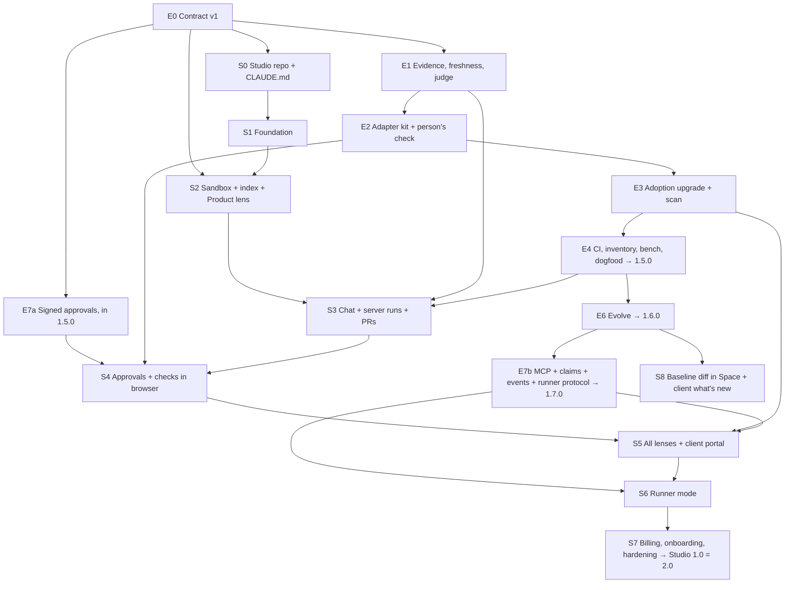

# 05 — Build program for Claude Code

> **Purpose:** the exact order in which Claude Code builds engine 1.5–1.7 and Studio 1.0,
> one work package (WP) per session, each with a clear "done when".
> **Read with:** README (decisions), files 01–04 (what to build).

---

## 1. How Claude Code works through this program

### 1.1 Session protocol (every session)

1. Read `CLAUDE.md` of the repo, this file's WP table, and the WP's section in files 01–04.
2. Say which WP you are doing. **One WP per session** (a large WP may take several sessions; record where you stopped).
3. Work on a branch `wp/<WP-ID>-<short-name>`. Never commit to `main` directly.
4. Write the tests first for each "done when" line, then the code.
5. Run the full checks (`npm test` in the engine; `make check` in Studio).
6. Update the WP's **status line** in `docs/PROGRESS.md` (date, what is done, what is left, test counts).
7. Open a pull request. Stop at the **checkpoint** and report to the owner in 5–10 lines: done, tests, anything decided, anything the owner must decide. Wait for "continue".

### 1.2 Rules that never bend

- **Engine:** no stack, product or customer names in `lib/` (the contamination guard test must pass); the SKILL and card token budgets hold; every command change keeps the contract tests green.
- **Studio:** never import engine code; talk to the engine only through `packages/engine-contract` and the pinned CLI/MCP; routers hold no business logic; every tenant query is scoped by `org_id`.
- **Both:** no secrets in code, logs or tests; only people approve; nothing is published, deployed or released without the owner's decision.
- If a WP needs a decision that isn't in files 01–04, **stop and ask**; don't invent product behavior.

### 1.3 Use RoyaScaff while building

Both repos become RoyaScaff projects (dogfooding; file 01 V13, file 04 §12), each at a set point:
- **Studio** from S0.2, using the published engine (`1.4.0-beta.4` or later; the plan files are imported by hand, and again with `adopt docs` after E3.3).
- **The engine** from E4.3, when the tool can be pinned and `adopt docs` exists. Before that, engine WPs follow this file and `docs/PROGRESS.md` only.
Once a repo is a RoyaScaff project, each WP is one change (CHG) or a small group of changes in its `project/`.

---

## 2. Order at a glance



Signed approvals (E7a) are pulled ahead of the rest of 1.7 because Studio's approvals depend on them. They ship in **1.5.0** (first in `1.5.0-alpha.2`).

The **exact** dependencies are in the "Needs" column of §3 and §4; the diagram shows the main lines only. A WP never starts before everything in its "Needs" column is done.

---

## 3. Engine work packages (`royascaff` repo)

| WP | Contents (file · section) | Needs | Done when | Size |
|---|---|---|---|---|
| **E0.1** | Repo move: one engine folder under git, tags per release, move this plan folder into `plans/v1.5-v2.0/`, `docs/PROGRESS.md`, `CLAUDE.md` (§5.1) | — | Tag `v1.4.0-beta.4` points at the beta.4 code; old folders are read-only history | S |
| **E0.2** | Contract envelope, error codes, `contract --json` (01 · §3 items 2–5) | E0.1 | Envelope schema + codes file; `contract` command tested | M |
| **E0.3** | `--json` for every command (01 · §3 item 1) | E0.2 | A test iterates over all commands in help and validates their JSON against schemas | L |
| **E0.4** | `events --since`, full `export --json`, non-interactive mode (01 · §3 items 6–8) | E0.3 | Studio's indexer inputs validate; `HUMAN_REQUIRED` returned instead of prompts | M |
| **E0.5** | `docs/CONTRACT.md`, contract tests, release `1.5.0-alpha.1` (01 · §3 items 9–10) | E0.4 | Contract suite green; package contains `contract/`; **owner publishes** | S |
| **E7a** | Signed approvals: issuers, JWS verify, `--approval-token`, `jti` store (03 · §6) → `1.5.0-alpha.2` | E0.5 | All C3 cases pass (valid, expired, reused, wrong issuer, wrong target, changed hash) | M |
| E1.1 | Check types on acceptance lines (01 · §4) | E0.5 | Parser + validate warning for untyped must lines | S |
| E1.2 | `verify` + evidence fingerprints + freshness (01 · §4) | E1.1 | A3 passes | L |
| E1.3 | Judge pack + `judge` + identity rule (01 · §4) | E1.2 | A4 passes | M |
| E1.4 | Repair loop + foundation-before-breadth (01 · §1 V5, V6) | E1.3 | Blocked after `repair_limit`; foundation order enforced | M |
| E2.1 | Adapter schema + `adapter new` + `adapter test` + `docs/ADAPTERS.md` (01 · §5) | E0.5 | A5 first half passes | M |
| E2.2 | General person's check kinds (`visual`, `transcript`, `demo`, `playtest`) (01 · §5) | E2.1 | The `transcript` check works on a CLI fixture; web behavior unchanged | M |
| E3.1 | Inferred records + `confirm` + layer coverage in `adopt` (01 · §6) | E0.5 | A6 passes | M |
| E3.2 | `scan --json` with adapter scan patterns (01 · §6) | E3.1 | Facts for JS/TS and Python modules; cached per blob hash | M |
| E3.3 | `adopt docs` (01 · §6) | E3.1 | Plan files 01–17 import as SRC/DEC records quoting their files | M |
| E4.1 | `inventory`, `ci`, GitHub Action template (01 · §7) | E1.2 | `ci` fails on gate errors; action tested in a sample repo | S |
| E4.2 | Benchmark harness + CLI fixture (01 · §7) | E2.2 | `bench/` runs ×3 and writes CSV | M |
| E4.3 | Dogfood the engine (01 · §8), acceptance A1–A8 → **`1.5.0`** | E1.4, E2.2, E3.3, E4.1, E4.2, E7a | Gate table all pass; owner approves release | M |
| E6.1 | Requirement, workflow and contract deltas (02 · §2) | E4.3 | B1 passes | L |
| E6.2 | Baselines, `diff`, `history` (02 · §3) | E6.1 | B2 passes | M |
| E6.3 | Flags, experiments, rollback, deprecation (02 · §4) | E6.2 | B3 passes | M |
| E6.4 | Scale: incremental scan, module checkpoints, `adopt --plan` (02 · §5) | E3.2, E6.1 | B5 passes | L |
| E6.5 | Migrate 1.5→1.6, real project validation → **`1.6.0`** | E6.1–E6.4 | B4, B6 pass | M |
| E7b.1 | `royascaff mcp` stdio + HTTP, tools, resources (03 · §2–3) | E6.5 | CLI and MCP results identical (C5) | L |
| E7b.2 | Claims + event stream (03 · §4–5) | E7b.1 | C2 passes; `events --follow` streams | M |
| E7b.3 | Runner protocol doc + reference runner test (03 · §7) | E7b.2 | C4 passes | M |
| E7b.4 | Skill v2 (MCP first), two-tool acceptance → **`1.7.0`** | E7b.3 | C1 passes | M |

---

## 4. Studio work packages (`royascaff-studio` repo)

| WP | Contents (file 04 section) | Needs | Done when | Size |
|---|---|---|---|---|
| **S0.1** | Create repo, layout (04 §12), `CLAUDE.md` (05 §5.2), copy the plans into `docs/plans/v1.5-v2.0/`, docker-compose, Makefile, CI skeleton, `docs/architecture.md`, ADR-001 (the decisions D1–D10) | E0.1 | `make dev` starts postgres, redis, minio, api, worker, web; CI green on an empty app | M |
| S0.2 | `royascaff init` for Studio itself; import this plan as its request (§12) | S0.1 | Studio's `project/` has discovery approved by the owner | S |
| S1.1 | Design system: tokens, themes, shadcn setup, app shell, command palette, empty/loading/error patterns (§8) | S0.1 | Storybook (or a `/design` page) shows all base components in light and dark | M |
| S1.2 | Auth: GitHub OAuth, magic link, sessions, CSRF, 2FA for admins (§7) | S0.1 | e2e: sign up, sign in, sign out; security tests for cookies and CSRF | M |
| S1.3 | Orgs, memberships, roles, invitations, RLS, audit log (§6, §7) | S1.2 | Tenant-isolation suite: every endpoint refuses another org's data | M |
| S1.4 | GitHub App: install, list repos, connect, create repo, webhooks (§5) | S1.3 | A repo can be connected and created from the UI in a test org | M |
| S2.1 | `packages/engine-contract`: generate TS + Pydantic from the engine's schemas; contract tests against `1.5.0-alpha.N` | E0.5, S0.1 | Types generated in CI; tests fail on any mismatch | S |
| S2.2 | Sandbox image + orchestrator (Docker locally), limits, egress allowlist (§5, §10) | S2.1 | A container runs `royascaff contract --json` on a cloned repo and is destroyed | M |
| S2.3 | Indexer job + projection tables (§6) | S2.2 | Index of a sample repo equals `royascaff export --json` exactly; rebuild works | M |
| S2.4 | Project Space: canvas, Product lens, side panel, search; Board; Change view (read-only) (§8) | S1.1, S2.3 | The Space matches `royascaff status`; 2,000-node test stays smooth | L |
| S3.1 | Runs in server mode: Agent SDK in the sandbox, budgets, event streaming via SSE (§4.1) | S2.2, S1.3 | A task run streams live to the Runs screen and stops at the budget | L |
| S3.2 | Branch per change, PR creation with evidence body, `royascaff ci` check (§5) | S3.1, S1.4, E1.2, E4.1 | A verified change opens a PR with tests and screenshots | M |
| S3.3 | Chat: assistant-ui dock, orchestrator agent, Studio tools, question cards, node context (§4.3) | S3.1 | From chat: plan a feature → answer a question card → start a run | L |
| S4.1 | Approval requests, review sheet, signed tokens (needs E7a), re-auth for high risk (§7) | S3.2, E7a | Project, roadmap and change approvals made in the browser are accepted by the engine | M |
| S4.2 | Person's check in the browser (bar lines, screenshots, preview link) (§8) | S4.1, E2.2 | A look recorded in Studio closes a change; the board shows the bar gaps | M |
| S5.1 | Architecture lens (components, rules, violations) (§8.1) | S2.4, E4.1 | Violations from `royascaff ci` show in red | M |
| S5.2 | Code graph lens (needs E3.2 `scan`) (§8.1) | S2.4, E3.2 | Modules → files → imports, linked to components; split view works | L |
| S5.3 | Team & client lens, comments, notifications (§8.1) | S4.1, E7b.2 | Claims and approvals visible per person | M |
| S5.4 | Client portal: share links, outcomes, delivered features, feedback, acceptance (§8; "what's new" comes in S8) | S4.2 | A client account sees no code and can accept a release | M |
| S6.1 | `royascaff-runner` CLI: login, poll, run `claude` headless, stream, push (needs E7b.3) (§4.2) | S3.1, E7b.3 | A task runs on a laptop; nothing but results leaves the machine | L |
| S6.2 | Runner management UI, job targeting, auto-accept per project | S6.1 | Jobs can target cloud or a chosen runner | S |
| S7.1 | Billing: Stripe plans, usage ledger, limits, caps and alerts (§11) | S3.1 | Test-mode subscription and metered usage end to end | M |
| S7.2 | Onboarding: first project in < 5 minutes, templates, guided tour | S4.2 | A new user reaches an approved project without help (5 test users) | M |
| S7.3 | Insights + engine-version A/B (§13) | S3.1 | Per-version charts from real runs | M |
| S7.4 | Hardening: security review fixes, load test, backups, runbooks, production infra (§10, §14) | S5.4, S6.2, S7.1–S7.3 | 0.9 gate passes; **owner decides the public launch** | L |
| S8 | Baseline diff in the Space timeline + client "what's new" (needs 1.6) | S2.4, E6.2 | The timeline slider shows changes between releases | M |

---

## 5. `CLAUDE.md` for each repo (starting content)

### 5.1 `royascaff/CLAUDE.md`

```markdown
# RoyaScaff engine — rules for Claude Code

- This repo is the engine (npm `royascaff`). Plans: `plans/v1.5-v2.0/` (files 01–03, 05).
- Work one WP per session from file 05 §3; branch `wp/<ID>-<name>`; update docs/PROGRESS.md; stop at the checkpoint.
- Run the pinned tool for project work: `npx royascaff` resolves to node_modules (alias royascaff-tool). Never run the working copy on itself.
- Tests first. `npm test` must pass. The contamination guard, the "no names in lib/" test and the token budgets must pass.
- Every command keeps its JSON envelope valid (contract tests). Adding fields = minor; removing = major (ask the owner).
- Core is generic: stack-specific behavior goes in adapters/*.json and their cards.
- Plain, simple English in docs and messages. Never publish to npm; the owner runs `npm run deploy`.
```

### 5.2 `royascaff-studio/CLAUDE.md`

```markdown
# RoyaScaff Studio — rules for Claude Code

- Plans: `docs/plans/v1.5-v2.0/` (a copy of the engine repo's master; README, file 04, file 05 §4). Decisions D1–D10 are fixed; ask before changing any.
- One WP per session from file 05 §4; branch `wp/<ID>-<name>`; update docs/PROGRESS.md; stop at the checkpoint.
- Never import engine code. Use packages/engine-contract types and the pinned `royascaff` CLI/MCP inside sandboxes.
- Backend layers: api (routers) → services → domain → adapters. domain imports no adapters. Routers hold no logic.
- Every tenant query is scoped by org_id; RLS stays on; add a tenant-isolation test for every new endpoint.
- Claude subscriptions never touch the server: API keys on the server, the user's own `claude` CLI only in the runner.
- UI: shadcn/ui + tokens from packages/ui; light and dark; empty, loading and error states; keyboard access; AA contrast.
- `make check` (lint, types, tests) must pass. No secrets in code, logs or fixtures.
- Never deploy, publish or change cloud resources; the owner does.
```

---

## 6. Prompts to start each phase

Paste one of these into Claude Code in the right repo. Each assumes the plan folder is available at the path in `CLAUDE.md`.

**Engine, phase E0:**
> Read CLAUDE.md and plans/v1.5-v2.0/README.md, 01 §3 and 05 §3. Do WP E0.1, then stop at the checkpoint and report.

**Studio, phase S0:**
> This is a new empty repo for RoyaScaff Studio. I have copied the plan folder to docs/plans/v1.5-v2.0/. Read its README.md, 04 and 05 §4–5. Do WP S0.1: create the layout, CLAUDE.md from 05 §5.2, docker-compose, Makefile, CI and ADR-001 with decisions D1–D10. Stop at the checkpoint and report.

**Any later WP:**
> Read CLAUDE.md and docs/PROGRESS.md. Do the next WP in file 05 whose dependencies are done. Tests first. Stop at the checkpoint and report.

---

## 7. Checkpoints for the owner

| After | You check | You decide |
|---|---|---|
| E0.5 | `royascaff contract --json` output | Publish `1.5.0-alpha.1` |
| S1.4 | Sign in, create an org, connect a repo | Visual direction OK? |
| S2.4 | The Space for one of your real repos | Lens design and layout |
| S3.2 | A real change: chat → run → PR | Agent cost per change acceptable? Model defaults |
| S4.2 | Approvals and a look done in the browser | Approval UX; re-auth rules |
| S5.4 | Client portal as a client | What clients may see |
| S6.1 | A run on your laptop | Runner model; R1 answer from Anthropic |
| S7.4 | Security review, load test | Pricing; public launch |

## 8. Rough effort

Sizes: S ≈ 1 session, M ≈ 2–3 sessions, L ≈ 4–6 sessions of Claude Code, plus your checkpoints.
Engine: 27 WPs. Studio: 26 WPs. With the two tracks in parallel, plan on **3–5 months** to Studio 1.0, depending on how many sessions run per week and how many checkpoint changes you make. The first useful internal milestone (S4.2: chat to a merged PR with every human step in the browser) comes after roughly a third of the Studio work.
