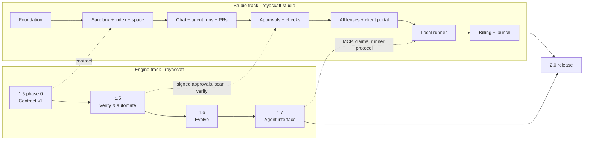

# RoyaScaff 1.5 → 2.0 — Plan index

> **Status:** draft for the owner's review · 2026-10-01
> **Builds on:** engine `1.4.0-beta.4` (published on npm, tag `beta`) and the 1.4 plan files in
> `benchmark/3d-network/version1.4-plan/` (especially 05, 06 and 07).
> **Supersedes:** file 06 §"2.0 team: a server (Postgres) becomes the truth" and the 2.0/2.x rows
> of file 07 §3. The owner's decisions below replace them.

## 1. What this folder holds

| File | Version | Theme | Repo |
|---|---|---|---|
| [01-engine-1.5-verify-and-automate.md](01-engine-1.5-verify-and-automate.md) | Engine 1.5 | Machine contract, real evidence, a separate judge, the adapter kit, better adoption | `royascaff` |
| [02-engine-1.6-evolve.md](02-engine-1.6-evolve.md) | Engine 1.6 | Changing what already exists: requirement deltas, baselines, flags, rollback, big codebases | `royascaff` |
| [03-engine-1.7-agent-interface.md](03-engine-1.7-agent-interface.md) | Engine 1.7 | MCP server, task claims, event stream, signed approvals, the runner protocol | `royascaff` |
| [04-royascaff-2.0-studio-saas.md](04-royascaff-2.0-studio-saas.md) | 2.0 | **RoyaScaff Studio**: the SaaS for teams, businesses and clients | `royascaff-studio` (new) |
| [05-build-program-for-claude-code.md](05-build-program-for-claude-code.md) | All | The order Claude Code builds everything in, one work package per session, with acceptance tests | both |

"RoyaScaff Studio" is a working name. **2.0** means the platform release: engine 1.7 plus Studio 1.0.

## 2. The owner's decisions (2026-10-01)

| # | Question | Decision |
|---|---|---|
| D1 | How does Studio reach Claude? | **Anthropic API key** on the server (Claude Agent SDK, Python), plus a **local runner**: a user with a Claude subscription connects their own machine, and their own Claude Code does the work there. |
| D2 | Source of truth for project knowledge | **The engine's files in the customer's git repo.** Studio's database is an index (rebuildable) plus Studio-only data: users, chats, comments, runs, billing. |
| D3 | First users | **Public SaaS from day one:** sign-up, workspaces, billing, onboarding. |
| D4 | Stack | **Next.js + TypeScript + Tailwind + shadcn/ui**, **React Flow** for the space, **assistant-ui** (MIT) for chat; **FastAPI (Python)** backend. |
| D5 | Where AI work runs | **A short-lived container per task** (Docker locally, Kubernetes Jobs or ECS tasks in production). |
| D6 | Engine ↔ Studio link | **A versioned CLI/MCP contract only.** Studio calls `royascaff … --json` and the 1.7 MCP tools against the engine version pinned by each project. It never imports engine code. |
| D7 | Space view at launch | All four lenses: **Product**, **Architecture**, **Code graph**, **Team & client**. |
| D8 | Hosting and billing | **Cloud + Stripe**: Docker images, Postgres, Redis, S3-compatible storage; seats + AI usage. |
| D9 | Git flow | **GitHub App; one branch and one pull request per change (CHG).** A person merges. Studio never pushes to the default branch. |
| D10 | Repositories | **Two repos:** `royascaff` (engine, npm) and `royascaff-studio` (monorepo: web, api, worker, runner, sandbox images, infra). |

### Licensing constraint behind D1 (must stay true)

Anthropic does not allow third-party products to offer claude.ai login or subscription rate limits
unless Anthropic has approved it; products built on the Agent SDK must authenticate with API keys
([Agent SDK overview](https://code.claude.com/docs/en/agent-sdk/overview)). Therefore:

- Studio's servers **never** hold, request or proxy a user's Claude subscription credentials.
- Server-side AI always uses an **API key**: the workspace's own key (BYOK) or Studio's platform key (billed as usage).
- The **local runner** only starts the user's already-installed `claude` CLI on the user's own machine, under the user's own login. Studio sends it tasks and receives results.
- **Before public launch**, confirm the runner model in writing with Anthropic (sales/partner contact). If it is not accepted, the runner ships in API-key mode only, and nothing else in the design changes. This is risk R1 in file 04.

## 3. Two tracks, one seam

- **The seam is the contract** (file 01 §3 and file 03). Studio depends on the contract version, never on engine internals. The engine does not know Studio exists.
- **Signed approvals** (file 03 §6) are pulled ahead of the rest of 1.7 and ship in **1.5.0** (first in `1.5.0-alpha.2`), because Studio's approvals need them.
- **Contract v1 is built first.** It is the only engine work Studio needs before it can start. The rest of 1.5, and 1.6, run in parallel with Studio.
- Every improvement to the engine reaches Studio by **raising the engine version a project pins**. Studio runs the contract tests for every engine version it supports.
- Studio helps improve the engine. It records (opt-in, anonymized) how each engine version performs: gate refusals, rework, time per stage, test pass rates. See file 04 §13.

## 4. Before anything: finish 1.4

1.4 still needs its pilot: the owner's Reading List test, `1.4.0-rc.1`, and the acceptance run (file 07 §5). **Contract v1 is the first 1.5 work.** It can start while the 1.4 pilot runs, because it only adds `--json` output and does not change behavior.

## 5. Where this folder lives

It is written in `royascaff-research/plans/v1.5-v2.0/`. In work package E0.1 (file 05) it moves into the engine repo as `plans/v1.5-v2.0/`. In S0.1 a copy goes into the Studio repo as `docs/plans/v1.5-v2.0/`, so each repo's Claude Code sessions can read it. The engine repo's copy is the master; Studio's copy is refreshed at each Studio checkpoint.

## 6. Rules that apply to every file here

1. Keep the engine generic: no stack, product or customer names in the engine core (the beta.4 contamination guard stays).
2. Keep git as the truth (D2): anything Studio shows about a project must be rebuildable from the repo.
3. Only people approve. In Studio, a person approves through a signed approval (file 03 §6), never the AI.
4. Each version has an acceptance gate. A version is not released until its gate passes.
5. Plain, simple English in all documents; files and IDs in English.
